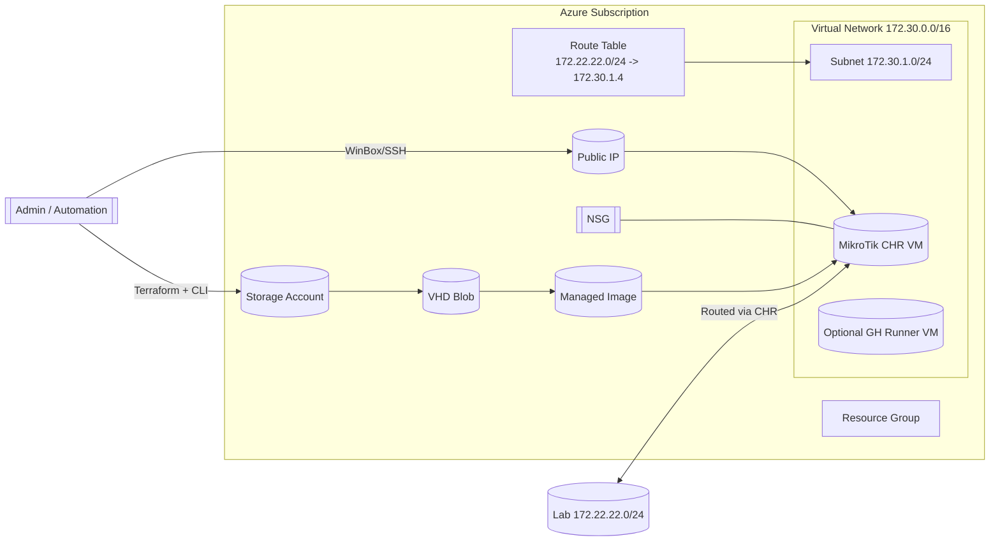

<div align="center">

# MikroTik CHR on Azure via Terraform & GitHub Automation

Provision a MikroTik Cloud Hosted Router (CHR) in Microsoft Azure using modular Terraform, automation scripts, (optionally) a self‑hosted GitHub Actions runner, and (optionally) Rover for visual plan inspection.

</div>

---

## 🚧 Status / Disclaimer
This repository is an evolving lab / PoC currently being hardened. It works for end‑to‑end provisioning, but several aspects (security hardening, config automation, parameterization) are still in flight.

### Pending / Roadmap (short list)
- Diagram-as-code refinement (Mermaid) & architecture doc expansion
- Cleanup of RouterOS base config (`prep-chr-config/*.rsc`)
- Secret management refactor (Key Vault or OIDC + ephemeral creds)
- Optional private self-hosted GitHub runner enablement (module commented out)
- Parametrized backend instead of static values in `provider.tf`
- Add automated tests / validation (terraform fmt / validate / tflint / checkov)
- Harden NSG rules (source restrictions + optional Just‑In‑Time)
- Pipeline examples (`.github/workflows/*.yml`) to be published

If you fork this now for learning or a lab, review the security section below first.

---

## 🧭 Architecture Overview
Core components deployed (current default path):

- Resource Group (pre-existing for backend, or created manually)
- Remote state backend in Azure Storage (pre-created values hard-coded in `provider.tf`)
- Virtual Network + dedicated Subnet for CHR
- Public IP (Standard, static, Zonal)
- Network Security Group (WinBox / SSH inbound – broad, tighten before prod!)
- Custom Image created from an uploaded MikroTik CHR VHD blob
- Single-zone VM (Linux image wrapping the CHR disk) with attached NIC + Route Table association
- Route table adding a lab/on‑prem prefix (`172.22.22.0/24`) next hop = CHR
- (Optional / future) Self-hosted GitHub Actions runner inside same subnet (no public exposure)

### Mermaid Diagram


---

## 📁 Repository Layout (key folders)
| Path | Purpose |
|------|---------|
| `terraform/azure` | Root Terraform stack orchestrating modules + remote backend definition |
| `terraform/azure/modules/*` | Reusable infra modules (vnet, subnet, nsg, pip, mikrotik, gh_runner, rg) |
| `deploy-params.json` | Central parameter file decoded in `main.tf` (simple poor-man’s var source) |
| `prep-chr-image/` | PowerShell + assets for CHR VHD preparation & compression prior to upload |
| `prep-chr-config/` | Base RouterOS configuration templates (`*.rsc`) – WIP cleanup |
| `scripts/` | PowerShell helper scripts (SP creation, GitHub secret management, workflow triggers) |
| `tools/rover/` | Rover visualization stack (Docker Compose) for plan inspection |

---

## 🧪 Modules Summary
| Module | Resources | Highlights / Notes |
|--------|-----------|-------------------|
| `vnet` | `azurerm_virtual_network` | Supports inline subnets (currently using separate `subnet` module for clarity) |
| `subnet` | `azurerm_subnet` | Creates a dedicated subnet for CHR & (optional) runner |
| `pip` | `azurerm_public_ip` | Standard SKU, static, zone-aware |
| `nsg` | `azurerm_network_security_group` + rules | Current rules allow SSH(22) + WinBox(8291) from `*` – tighten! |
| `mikrotik` | image + nic + vm + route table + association | Builds managed image from blob, deploys CHR VM, sets route |
| `gh_runner` (commented) | NIC + Linux VM | Future: auto-register GH Actions runner with custom_data cloud-init |
| `rg` | `azurerm_resource_group` | Provided but not wired in root (RG assumed pre-existing for backend) |

---

## 📦 Parameters (`deploy-params.json`)
Instead of many `-var` flags this lab loads a JSON file into `local.params`. Key fields:

| Key | Purpose |
|-----|---------|
| `location` | Azure region for resources |
| `resource_group` | Existing RG (also used by backend) |
| `storage_account` / `container_name` | Location of uploaded CHR VHD Blob |
| `image_file` / `vhd_name` | Local ZIP + expected unzipped VHD name |
| `vnet_name` / `subnet_name` | Network objects for CHR deployment |
| `azurerm_image_name` | Managed image resource name |
| `azurerm_network_interface_name` | NIC name for CHR VM |
| `azurerm_virtual_machine_name` | CHR VM name |
| `storage_os_disk_name` | OS disk name for VM |
| `storage_os_disk_managed_disk_type` | e.g. `StandardSSD_LRS` |
| `azurerm_route_table_name` | Route table for lab/on-prem route |
| `azurerm_virtual_machine_vm_size` | VM size (CHR usage) |
| `mikrotik_ip` | Intended CHR internal IP (used in docs / route) |
| `os_profile_admin_password` | Placeholder (should come from secret, not JSON) |
| `public_ip_name` / `nsg_name` | Supporting network resource names |
| `gh_runner_*` | Optional self-hosted runner parameters |

Secrets / sensitive values (passwords, GitHub tokens) MUST be moved to a secure store (Key Vault, GitHub Encrypted Secrets, environment variables injected at runtime).

---

## 🔐 Security Notes (READ THIS)
| Concern | Current State | Recommendation |
|---------|---------------|----------------|
| Backend configuration | Hard-coded in `provider.tf` | Use `-backend-config` and/or partials; parameterize via variables or environment |
| Admin / CHR Password | Stored as key in JSON placeholder | Remove from repo; inject via `TF_VAR_` env or `az keyvault secret show` data source |
| NSG inbound sources | `*` (any) | Restrict to administrative IPs / jump host; consider Azure Firewall / Bastion |
| Route exposure | Static next hop IP | Validate CHR readiness before advertising routes |
| GitHub runner secrets | Token values in JSON (placeholder) | Use ephemeral registration tokens via workflow & OIDC |
| State file protection | Remote backend assumed pre-existing | Enable soft delete + blob versioning + access policies |

Hardening backlog includes: Key Vault integration, JIT access, OIDC-based SP auth (no long-lived client secret), scanning with `checkov`.

---

## 🚀 Quick Start (Manual Terraform Path)
1. Prepare (or create) the remote backend resources (RG + Storage Account + container) matching `provider.tf`.
2. Edit `deploy-params.json` with your naming + sizes + region.
3. Upload / stage the MikroTik CHR VHD blob to `https://<storage>.blob.core.windows.net/vhds/<vhd_name>` (ensure the URI in `modules/mikrotik/main.tf` matches – currently static!).
4. (Temporary) Replace any placeholder secrets by exporting environment variables instead of editing files:
   ```powershell
   $env:TF_VAR_os_profile_admin_password = '<StrongPassword!>'
   ```
5. Initialize + plan + apply:
   ```powershell
   terraform -chdir=terraform/azure init
   terraform -chdir=terraform/azure validate
   terraform -chdir=terraform/azure plan -out tfplan
   terraform -chdir=terraform/azure apply tfplan
   ```
6. Connect to CHR (WinBox over the Public IP / SSH on port 22 if enabled). Change defaults immediately.

Destroy when done:
```powershell
terraform -chdir=terraform/azure destroy -auto-approve
```

---

## 🤖 (Upcoming) GitHub Actions Flow (Concept)
Although workflow YAML is not yet committed, the intended pattern:

| Stage | Workflow (planned) | Description |
|-------|--------------------|-------------|
| Infra Prep | `prepare-infra.yml` | Creates SP, backend container, uploads VHD, sets secrets |
| Plan | `plan-chr.yml` | Runs `terraform plan` & uploads `plan.json` artifact |
| Visual Review | (Manual) Rover | Pull `plan.json` – visualize before apply |
| Apply | `deploy-chr.yml` | Applies approved plan |
| Config | `prepare-chr-config.yml` | (Future) Pushes initial RouterOS config via runner |
| Destroy | `destroy-chr.yml` | Optional environment cleanup |

Sample snippet (future):
```yaml
jobs:
  plan:
    runs-on: ubuntu-latest
    steps:
      - uses: actions/checkout@v4
      - uses: hashicorp/setup-terraform@v3
      - name: Terraform Init
        run: terraform -chdir=terraform/azure init
      - name: Terraform Plan
        run: terraform -chdir=terraform/azure plan -out tfplan && terraform -chdir=terraform/azure show -json tfplan > plan/plan.json
      - uses: actions/upload-artifact@v4
        with:
          name: plan-json
          path: plan/plan.json
```

---

## 🛰 Rover Plan Visualization (Optional)
The folder `tools/rover/` contains a `docker-compose.yml` for running [Rover](https://github.com/im2nguyen/rover). Steps:
1. Produce a plan JSON locally or in CI: `terraform show -json tfplan > plan.json`
2. Copy `plan.json` to your NAS share (e.g. `/volume1/rover/plan.json`)
3. Deploy the stack (Portainer or `docker compose up -d`) – open Rover UI in browser.

Future enhancement: artifact download + automatic sync to NAS.

---

## 🔧 CHR Image Preparation (Summary)
See `prep-chr-image/00_MikroTik_CHR_Azure_Image_Prep.ps1` (not yet fully documented here). General pattern:
1. Download official CHR raw disk / VHD.
2. (Optionally) Compress to `.zip` for repo tracking.
3. Upload extracted `.vhd` to Azure Storage (blob type: page blob) in the `vhds` container.
4. Ensure URI in `modules/mikrotik/main.tf` matches actual blob URL.

Improvement planned: parameterize blob URI using variables instead of hard-coded string.

---

## 🛠 RouterOS Base Config
The file `prep-chr-config/routeros-7.18-base-template.rsc` is an initial seed (WIP). Future automation ideas:
- Apply via an Azure VM extension (custom script) once CHR accessible
- Push via self-hosted runner using SSH + `/tool fetch` + `/import`
- Template substitution (Jinja2 / gomplate) for IPs & credentials

---

## 🧹 Known Gaps / Technical Debt
- Hard-coded image blob URI
- Backend not parameterized
- Password placeholder in JSON
- Unused `rg` module in root stack
- No TFLint / Checkov scanning committed
- No automated test harness for module contract validation
- Wide-open NSG ingress rules

---

## ✅ Next Suggested Enhancements (PRs Welcome)
| Item | Effort | Impact |
|------|--------|--------|
| Parameterize image blob URI | Low | Flexibility / reusability |
| Add `.github/workflows` set | Medium | CI/CD enablement |
| Introduce Key Vault secret data source | Medium | Security |
| Add TFLint + Checkov + pre-commit | Medium | Quality & shift-left |
| NSG source restriction + variable | Low | Security |
| Make route table optional | Low | Flexibility |
| Cloud-init for GH runner registration | Medium | Automation |

---

## 🙏 Acknowledgements
Thanks to [Hugo Rodrigues](https://www.linkedin.com/in/hmsrodrigues/) for foundational collaboration on the initial prototype.

---

## 🤝 Contributing
Until workflows are published, feel free to:
1. Fork & branch
2. Run `terraform fmt` before PR
3. Describe security-impacting changes clearly

---

## 🐛 Troubleshooting Quick Notes
| Symptom | Likely Cause | Fix |
|---------|--------------|-----|
| Image provisioning fails | Blob URI wrong / not page blob | Re-upload as page blob via `az storage blob upload --type page` |
| VM stuck creating | Zone mismatch / quota | Check region quota & zone availability |
| Cannot WinBox/SSH | NSG or local firewall | Verify NSG rule + public IP association |
| Route not effective | Wrong next hop or IP mismatch | Confirm CHR internal IP + static route config |

---

## 📄 License
See `LICENSE` file (MIT unless otherwise stated).

---

## 🧾 Change Log (High Level)
| Date | Change |
|------|--------|
| 2025-10-07 | Major README overhaul & documentation expansion |

---

## 💬 Feedback / Questions
Open an Issue or Discussion with details; include Terraform version + region + redacted plan snippet if reporting a provisioning problem.

---

Happy labbing & automate responsibly 🚀


